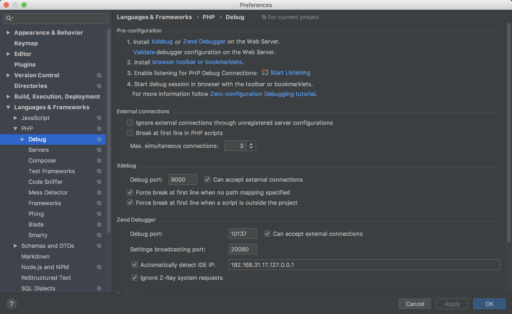
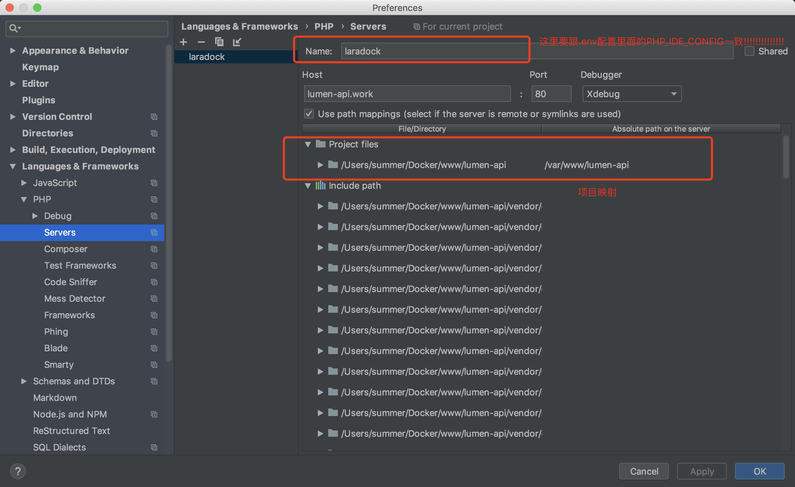
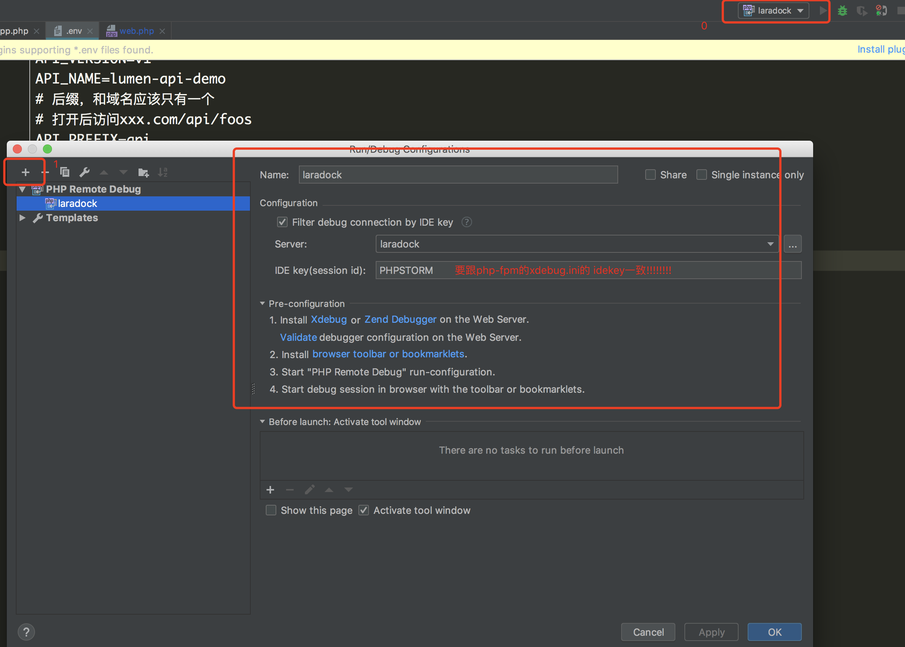

# xdebug 调试

### 配置参数
`workspace/xdebug.ini`
`php-fpm/xdebug.ini`
```
; NOTE: The actual debug.so extention is NOT SET HERE but rather (/usr/local/etc/php/conf.d/docker-php-ext-xdebug.ini)

;xdebug.remote_host=dockerhost
;mac docker 配置
xdebug.remote_host = docker.for.mac.localhost
;很重要,remote_connect_back = 0 最好关闭,自己手动声明
xdebug.remote_connect_back = 0
xdebug.remote_port = 9000
xdebug.idekey = PHPSTORM

;不要自动打开,通过谷歌浏览器的小虫来控制
xdebug.remote_autostart = 0
xdebug.remote_enable = 1
xdebug.cli_color = 1
xdebug.profiler_enable = 0
xdebug.profiler_output_dir = "~/xdebug/phpstorm/tmp/profiling"

xdebug.remote_handler = dbgp
xdebug.remote_mode = req

xdebug.var_display_max_children = -1
xdebug.var_display_max_data = -1
xdebug.var_display_max_depth = -1
```

`.env`
```
### WORKSPACE #############################################
...
WORKSPACE_INSTALL_XDEBUG=true
...


### PHP_FPM ###############################################
...
#安装xdebug
PHP_FPM_INSTALL_XDEBUG=true
...


### MYSQL #################################################
#不要使用MySQL最新版本,8.0以后跟5.7登录有区别
MYSQL_VERSION=5.7


```

## 配置PHPstorm

>- 

>- 

>- 

## console调试

`workspace/aliases.sh`

```
# 设置client模式debug
alias idekey='export XDEBUG_CONFIG="idekey=PHPSTORM"'
```

在workspace下执行command命令之前执行`idekey`就可以调试


## 自己使用命令

在mac下打开 ~/.bash_profile

```
alias docker-compose="cd /Users/summer/Docker/laradock && docker-compose"
alias phpenv="docker-compose up -d nginx mysql redis"
alias lws="docker-compose exec --user=laradock workspace bash"
alias ldcd="cd /Users/summer/Docker/laradock"
```


